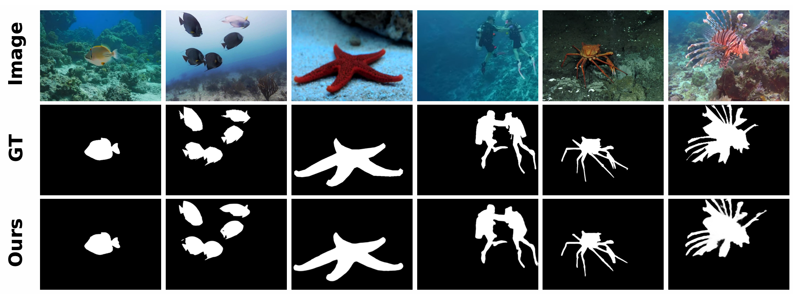

# HDANet: Enhancing Underwater Salient Object Detection with Physics-Inspired Multimodal Joint Learning

Source code for our paper “**HDANet: Enhancing Underwater Salient Object Detection with Physics-Inspired Multimodal Joint Learning**”.

## Method
The HDANet addresses USOD challenges through developing targeted designs. It first integrates a task-driven underwater image enhancement module, named HydroDepthEnhanceModule (HDEM). Furthermore, we develop a physics-inspired three-way unsupervised learning strategy, leveraging the complementary effects of re-enhancement and re-degradation to improve HDEM’s generalization across diverse underwater image degradation scenarios. Additionally, we design a robust cross-attention (RCA) module to effectively fuse multimodal features while mitigating noise and blurring by exploiting channel and spatial cross-attention mechanisms. 

## Result

(1) **Trained models** are available [BaiduNetdisk](https://pan.baidu.com/s/1VXyNHxy5Iy5GYYBCh_2thg) **fetch code**: [usod]  &&& [Googledriven](https://drive.google.com/file/d/1x_UhY7Ik6rFqkk4f5wNG97_CfC_DD7JZ/view?usp=drive_link) 

(2) **Predicted saliency maps of USOD10K** are available [BaiduNetdisk](https://pan.baidu.com/s/1EpnE07lgamyaUIUZWdccqA) **fetch code**: [usod] &&& [Google driven](https://drive.google.com/file/d/1D4wLLol843DEpolmO-cYpo2jaiBY7Ufn/view?usp=drive_link)

(3) **Predicted saliency maps of USOD** are available [BaiduNetdisk](https://pan.baidu.com/s/1cnmMZ0JSshssm2jc9p2BdA ) **fetch code**: [usod]  &&& [Google driven](https://drive.google.com/file/d/1YoXKUKaauy2PkkISpK-QWJpetXIsTsrO/view?usp=drive_link)

## USOD dataset

USOD10K dataset:  Baidu Netdisk: [USOD10K](https://pan.baidu.com/s/1edg2B9HjnHdEpmwnUOT0-w) **fetch code**: [good]  &&&  Google drive: [USOD10K](https://drive.google.com/file/d/1PH0PwKchXnkWwtAwbhNSW4utMCp5zer8/view?usp=sharing).

USOD dataset:[USOD](https://irvlab.cs.umn.edu/resources/usod-dataset)

